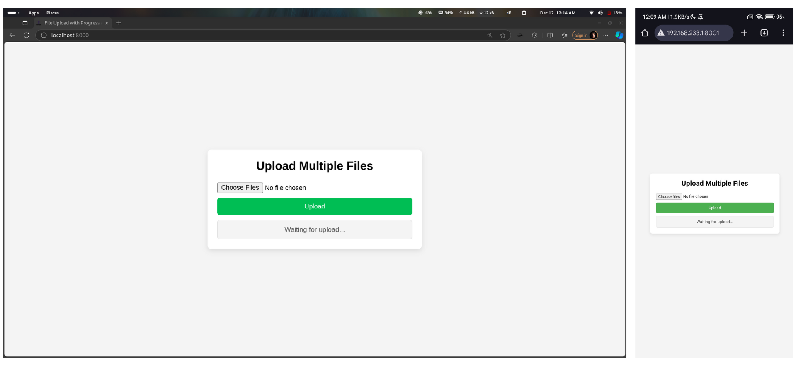
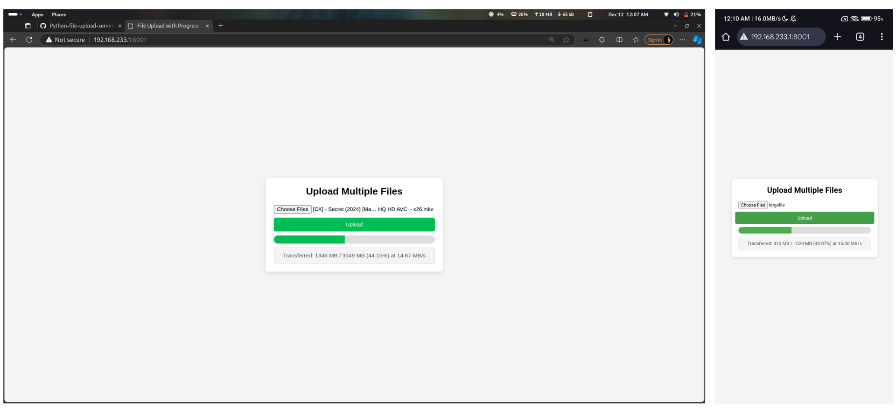

# File Upload Server

A simple Python-based file upload server with speed indicators.

## Features
- Upload multiple files with real-time progress and speed.

## Installation
1. Clone the repository:
   ```bash
   git clone https://github.com/navnee1h/file-upload-server.git
   cd file-upload-server
   ```
2. Create the uploads directory:
   ```bash
   mkdir uploads
   ```

## Usage
1. Start the server:
   ```bash
   python server.py
   ```
2. Open `http://localhost:8000` in your browser to upload files.

## File Structure
- `server.py`: Backend script.
- `index.html`: Frontend.
- `uploads/`: Storage for files.

## Screenshots

### Upload Interface


### Progress and Speed Indicator


---------------------------------------------------------------------------- Happy coding ! -------------------------------------------------------------
